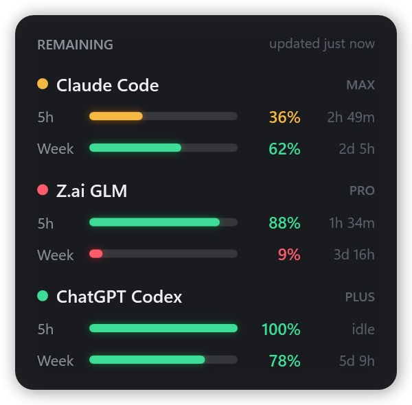

# TokenThrifter

A tiny, always-there Windows desktop widget that shows how much of your **5-hour** and **weekly**
allowance is left for **Claude Code**, **Z.ai (GLM Coding Plan)** and **ChatGPT Codex** — at a glance,
color-coded, no browser tabs.



*(Screenshot uses demo numbers.)*

- **Green** ≥ 50% left · **Amber** 20–50% · **Red** < 20%. The dot beside each service shows its tightest window.
- The right column counts down to each window's reset. Hover a bar for the exact reset time.
- `idle` means the window hasn't started yet (you haven't used that service since it last reset).
- Starts automatically with Claude Code and closes about 45 seconds after your last Claude Code session ends.
- Pure PowerShell + WPF — nothing to compile, nothing to `npm install`, no admin rights.

## Requirements

- Windows 10/11 with Windows PowerShell 5.1 (built in).
- **Claude Code** signed in with a Claude subscription (Pro/Max) — the desktop app's Code tab or the CLI.
  The `claude` CLI must be on your `PATH` (the default native install puts it in `~\.local\bin`).
- Optional: **Z.ai** GLM Coding Plan — a key in `ZAI_API_KEY`, *or* Claude Code already pointed at Z.ai
  (`ANTHROPIC_BASE_URL` = `https://api.z.ai/api/anthropic` with `ANTHROPIC_AUTH_TOKEN`, in your environment
  or in `~/.claude/settings.json` → `env`).
- Optional: **ChatGPT Codex** CLI signed in with ChatGPT (Plus/Pro). Usage appears after you've run Codex at least once.

Services you don't use just show a short note instead of bars.

## Install

```powershell
git clone https://github.com/<you>/TokenThrifter.git
cd TokenThrifter
powershell -ExecutionPolicy Bypass -File .\install.ps1
```

That copies the widget to `~\.claude\tokenthrifter\`, adds one `SessionStart` hook to
`~\.claude\settings.json` (a backup is saved as `settings.json.tokenthrifter.bak`), and starts the widget.
Restart any open Claude Code sessions so they pick up the hook.

**Uninstall:** `powershell -ExecutionPolicy Bypass -File .\install.ps1 -Uninstall`

**Just try it without installing:**
`powershell -ExecutionPolicy Bypass -STA -File .\TokenThrifter.ps1 -Demo`

## Using it

| Do this | To |
|---|---|
| Drag the card | Move it (position is remembered) |
| Right-click → **Refresh now** | Update immediately (it refreshes every 2 minutes anyway) |
| Right-click → **Always on top** | Keep it above other windows |
| Right-click → **Close with Claude Code** | Untick to keep it open after Claude Code exits |
| Right-click → **Exit** | Close it (it comes back with your next Claude Code session) |

## How it gets the numbers

Everything is read with credentials already on your machine; nothing is sent anywhere except the service's own API.

| Service | Source |
|---|---|
| Claude Code | `api.anthropic.com/api/oauth/usage`, using the sign-in token Claude Code keeps in `~\.claude\.credentials.json`. When that token has gone stale, TokenThrifter quietly runs `claude -p /usage` — a local command that makes Claude Code refresh its own sign-in **without a model call or any usage**. |
| Z.ai | `api.z.ai/api/monitor/usage/quota/limit` with your Z.ai key. |
| Codex | The rate-limit snapshot Codex CLI writes to `~\.codex\sessions\` (no network call). It updates whenever you use Codex; if it's old, the widget says "last seen …". |

> The Claude and Z.ai usage endpoints are the ones their own apps use; they aren't formally documented and
> could change. If a row suddenly shows an error, that's the likely reason — issues and PRs welcome.

## Troubleshooting

- **Nothing appears after install** — make sure the widget isn't off-screen: delete `%APPDATA%\TokenThrifter\config.json` and run `install.ps1` again.
- **Claude row says "Sign-in expired"** — run `claude` once in a terminal, or check `claude` is on your `PATH`.
- **Z.ai row says "No Z.ai key found"** — set it: `setx ZAI_API_KEY "your-key"`, then restart Claude Code.
- **Codex row says "No Codex usage recorded yet"** — run any Codex task once.

## License

MIT — see [LICENSE](LICENSE).
